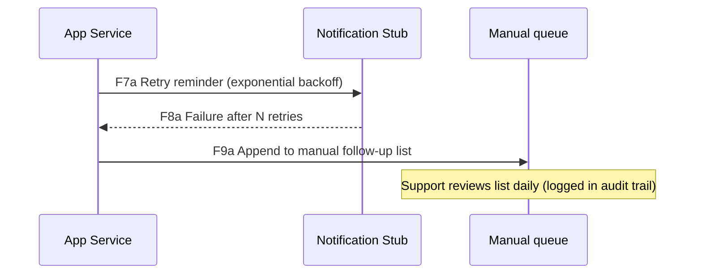

# DFD — Roommate Chores Service

## Контекстная диаграмма

```mermaid
flowchart LR
    subgraph TB0 [Trust Boundary: Clients / Untrusted Network]
        Owner[Owner device\n(Laptop)]
        Roommate[Roommate device\n(Mobile)]
        Support[Support engineer\nBrowser]
    end

    subgraph TBedge [Trust Boundary: Edge / Ingress]
        Edge[HTTPS ingress\n(Uvicorn + TLS)]
    end

    subgraph TBcore [Trust Boundary: Core services]
        App[Roommate Chores API\n(app/main.py)]
        Worker[Notification stub\n(async task)]
    end

    subgraph TBdata [Trust Boundary: Data plane]
        Secrets[(Secret store /.env)]
        DB[(SQLite / Postgres)]
        Logs[(Observability stack)]
    end

    subgraph TBcicd [Trust Boundary: CI/CD]
        CI[GitHub Actions\n(pipeline)]
        Registry[(Container registry)]
    end

    Owner -- F1: TLS upload APP_API_KEY --> Secrets
    Secrets -- F2: Inject env vars --> Edge
    Roommate -- F3: HTTPS JSON (X-API-Key) --> Edge
    Edge -- F4: Internal HTTP --> App
    App -- F5: SQL CRUD --> DB
    App -- F6: JSON responses (/stats) --> Roommate
    App -- F7: HTTPS reminder payload --> Worker
    Worker -- F8: Callback / delivery status --> App
    App -- F9: Structured audit logs --> Logs
    Support -- F10: Read-only dashboards --> Logs
    CI -- F11: Build & push image --> Registry
    Registry -- F12: Deploy container --> Edge
```

## Альтернативный сценарий: деградация уведомлений



## Таблица потоков

| ID | Канал / Протокол | Описание | Активы |
|----|------------------|----------|--------|
| F1 | HTTPS + password manager | Владелец создаёт `APP_API_KEY` и загружает в secret store / `.env` (локально). | API ключ, инструкции деплоя |
| F2 | Secure secret mount | Контейнер читает секреты на старте (`APP_API_KEY`). | API ключ, конфигурация |
| F3 | HTTPS REST (JSON) | Клиенты вызывают `/users`, `/chores`, `/assignments`, `/stats` с `X-API-Key`. | Пользовательские данные, задания |
| F4 | Loopback HTTP | Ingress передаёт запрос в приложение и внедряет заголовки трассировки. | Тело запроса, метаданные |
| F5 | SQL (SQLite/Postgres) | CRUD-операции над пользователями, задачами и назначениями. | Персональные данные, статусы |
| F6 | HTTPS JSON response | API возвращает результаты (включая `/stats`). | Агрегированные данные, correlation_id |
| F7 | HTTPS webhook | Сервис формирует напоминания и отправляет их в stub/очередь. | Имя задачи, адресат, due_at |
| F8 | HTTPS callback | Stub сообщает об успехе/ошибке доставки. | Delivery status, correlation_id |
| F9 | TCP/HTTPS (OTLP) | Приложение пишет структурированные аудиты/метрики в observability. | Идентификаторы запросов, статусы |
| F10 | HTTPS dashboard | Support читает логи/метрики (read-only). | Логи (без PII), health |
| F11 | GitHub Actions → Registry (OIDC) | CI собирает образ и пушит его в приватный registry. | Docker образ, SBOM |
| F12 | Registry → Edge (deploy) | Деплой подтягивает подписанный образ в production ingress. | Артефакты билда, конфиги |

Trust boundaries:

1. **TB0 ↔ TBedge** — недоверенная сеть между клиентами и ingress.
2. **TBedge ↔ TBcore** — переход из edge в бизнес-логику.
3. **TBcore ↔ TBdata** — доступ к БД, секретам и логам.
4. **TBcore ↔ TBcicd** — supply-chain поток через CI/CD и registry.
5. **TBcore ↔ Worker / Fallback** — внешние уведомления и ручные процедуры.
